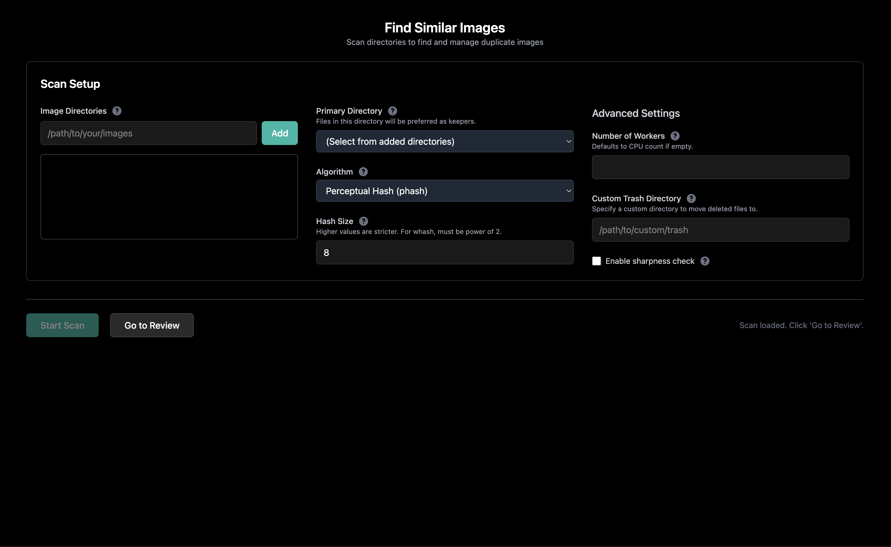
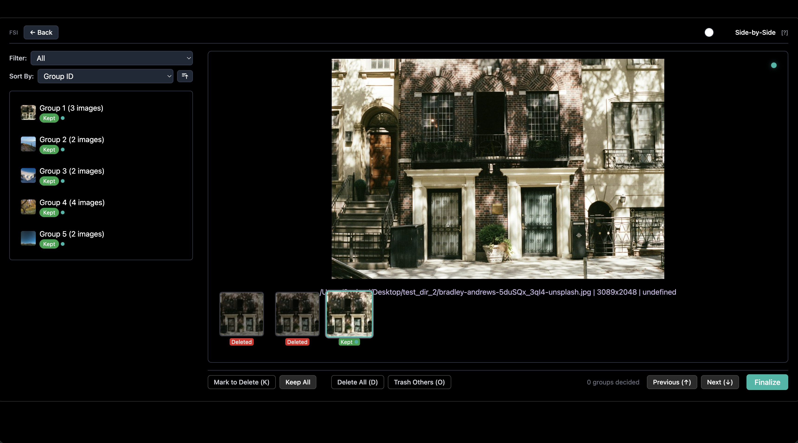

# Find Similar Images

> Intelligent duplicate image detection and management tool using perceptual hashing

[](LICENSE)
[](https://www.python.org/)

## Quick Start

### One-Command Installation

```bash
# Clone, setup, install, and run (all in one)
git clone https://github.com/YOUR_USERNAME/find_similar_images.git && \
cd find_similar_images && \
python3 -m venv venv && \
source venv/bin/activate && \
pip install -r backend/requirements.txt && \
python -m backend.app
```

Then open your browser to: **http://localhost:8000**

### After Installation (Subsequent Runs)

```bash
# Navigate to project directory
cd find_similar_images

# Activate virtual environment
source venv/bin/activate

# Start the application
python -m backend.app
```

---

## Screenshots

### Scan Setup Screen


### Review Interface


---

## Features

- **8 Hash Algorithms** - phash, ahash, dhash, dhash_vertical, phash_simple, whash, colorhash, crop_resistant
- **Multi-Directory Scanning** - Scan multiple folders with configurable recursion
- **Side-by-Side Comparison** - Review similar images with toggleable comparison mode
- **Safe Deletion** - Files moved to system trash, never permanently deleted
- **Smart Suggestions** - Intelligent keeper suggestions based on sharpness, resolution, and metadata
- **Parallel Processing** - Multi-threaded hashing for faster scans
- **Persistent Cache** - Reuse hashes across scans for speed
- **Modern UI** - Dark theme with intuitive keyboard shortcuts
- **Image Metadata** - View resolution, file size, EXIF data, and sharpness scores

---

## System Requirements

- Python 3.8 or higher (tested on 3.14)
- macOS, Linux, or Windows
- 512MB RAM minimum
- Modern web browser (Chrome, Firefox, Safari, Edge)

---

## Configuration

### UI Controls (Adjustable Per Scan)

These settings can be adjusted in the web interface for each scan:

- **Algorithm** - Choose from 8 hash algorithms (phash, ahash, dhash, etc.)
- **Hash Size** - **THE ONLY similarity control** (2-64, default 8)
  - **Lower values** (e.g., 4-6) = more lenient matching (groups more images together, including less similar ones)
  - **Higher values** (e.g., 16-32) = stricter matching (only groups very similar images)
- **Workers** - Number of parallel hashing threads (defaults to CPU cores)
- **Trash Directory** - Custom location for deleted files (defaults to system trash)
- **Sharpness Check** - Enable intelligent keeper suggestions based on image sharpness

### Environment Variables (Set Before Starting App)

These are system-level settings that require restarting the app to change:

| Variable | Default | Description |
|----------|---------|-------------|
| `HASH_DB` | `data/hash_cache.json` | Hash cache file location |
| `DB_PATH` | `data/app.db` | SQLite database path |
| `THUMBNAIL_MAX_SIZE` | `640` | Maximum thumbnail dimension in pixels |

### Example Usage

```bash
# Set environment variables (optional - most settings are in UI)
export HASH_DB=/custom/path/hash_cache.json
export THUMBNAIL_MAX_SIZE=1024
python -m backend.app
```

**Note:** Settings like algorithm, hash size, workers, and trash directory are set in the UI per scan, so environment variables are only needed for system-level defaults.

---

## Hash Algorithms Guide

| Algorithm | Speed | Accuracy | Best For |
|-----------|-------|----------|----------|
| `phash` (default) | Medium | High | General purpose |
| `ahash` | Fast | Medium | Quick scans, less precision |
| `dhash` | Fast | Medium | Detecting horizontal changes |
| `dhash_vertical` | Fast | Medium | Detecting vertical changes |
| `whash` | Medium | High | Wavelet-based, robust |
| `colorhash` | Fast | Medium | Color distribution matching |
| `crop_resistant` | Slow | Very High | Cropped or resized images |
| `phash_simple` | Fast | Medium | Simplified perceptual hash |

### Hash Size Parameter

- **Range:** 2-64
- **Default:** 8
- **Higher values** = stricter matching (finds subtle differences, creates smaller groups)
- **Lower values** = more lenient matching (groups more images together, creates larger groups)

**Important:** This app uses `--group` mode to show ALL duplicates in a group (not just pairs). The `max_distance` parameter (similarity threshold) is incompatible with group mode, so **hash size is the ONLY way to tune similarity**.

---

## Keyboard Shortcuts

| Key | Action |
|-----|--------|
| `K` | Toggle Keep/Delete for selected image |
| `D` | Mark all images in group for deletion |
| `O` | Keep suggested image, trash others |
| `P` | Keep only selected image, trash others |
| `↑` / `↓` | Navigate between groups |
| `←` / `→` | Select previous/next image in group |
| `Z` (hold) | Magnify current image |
| `?` | Show shortcuts help dialog |

---

## Project Structure

```
find_similar_images/
├── backend/
│   ├── app.py              # FastAPI application entry
│   ├── config.py           # Configuration management
│   ├── requirements.txt    # Python dependencies
│   ├── api/
│   │   └── routes.py       # API endpoints
│   ├── core/
│   │   ├── hash_engine.py  # Image hashing and grouping
│   │   └── file_manager.py # File operations
│   ├── utils/
│   │   ├── image_utils.py  # Metadata extraction
│   │   └── thumbnails.py   # Thumbnail generation
│   ├── static/
│   │   ├── script.js       # Frontend logic
│   │   └── style.css       # Custom styling
│   └── templates/
│       └── index.html      # Server-rendered template
├── data/
│   ├── app.db              # SQLite database
│   ├── hash_cache.json     # Persistent hash cache
│   └── thumbnails/         # Cached thumbnails
├── docs/
│   ├── ARCHITECTURE.md     # Detailed architecture docs
│   └── project_purpose.md  # Project overview
└── README.md               # This file
```

---

## API Endpoints

For advanced users and developers:

```
POST   /api/scan                    - Start background scan
GET    /api/scan/{job_id}          - Poll scan status
GET    /api/groups                 - Get paginated groups
POST   /api/actions/trash          - Move files to trash
GET    /api/thumbnail              - Get cached thumbnail
```

---

## Troubleshooting

### Scan gets stuck at 0%
- Check that directories are readable
- Verify images are in supported formats (Only tested with .jpg, .jpeg, but others might work)
- Check console for error messages

### Images not grouping together
- Try adjusting **hash size** in the scan setup:
  - **Increase hash size** (e.g., 16 or 32) if you want STRICTER matching (only very similar images)
  - **Decrease hash size** (e.g., 4 or 6) if you want MORE LENIENT matching (groups more images)
- Use `crop_resistant` algorithm for cropped or resized images
- Try different algorithms - some work better for specific image types

### Slow scanning
- Reduce number of workers if CPU usage is too high
- Use faster algorithms like `ahash` or `dhash`

### Virtual environment issues
- Make sure you activated the venv: `source venv/bin/activate`
- Verify Python version: `python --version` (3.8+, tested on 3.14)
- Reinstall dependencies: `pip install -r backend/requirements.txt`

---

## Development

### Architecture

- **Backend:** FastAPI + SQLite
- **Frontend:** Vanilla JavaScript + Tailwind CSS
- **Hashing:** duplicate-images library
- **Image Processing:** OpenCV

---

## Dependencies

```
fastapi>=0.104.0           # Web framework
uvicorn[standard]>=0.24.0  # ASGI server
python-multipart>=0.0.6    # File upload support
send2trash>=1.8.2          # Safe file deletion
duplicate-images>=1.0.0    # Perceptual hashing engine
jinja2>=3.1.2              # Template rendering
opencv-python>=4.8.0       # Image processing and sharpness detection
```

---

## License

MIT License - see [LICENSE](LICENSE) file for details.

---

## Acknowledgments

Built with:
- [duplicate-images](https://github.com/elisemercury/Duplicate-Images) - Perceptual hashing engine
- [FastAPI](https://fastapi.tiangolo.com/) - Modern web framework
- [OpenCV](https://opencv.org/) - Image processing
- [Tailwind CSS](https://tailwindcss.com/) - Styling
